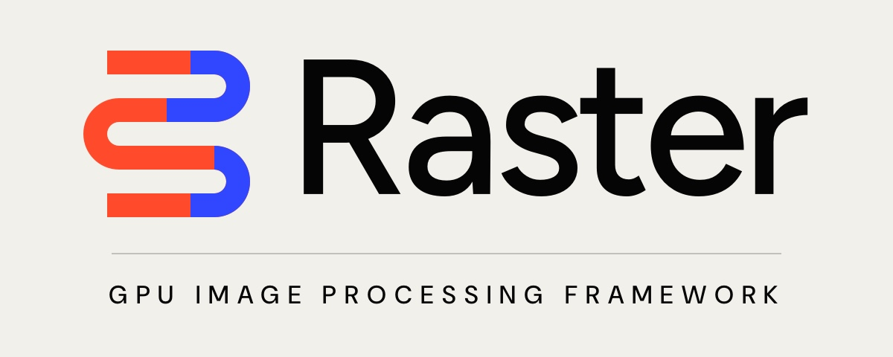

<p align="center">
  
</p>

<p align="center">
  <a href="docs/content/docs/reference/platform-support.mdx"></a>
  <a href="#installation"></a>
  <a href="LICENSE"></a>
</p>

Raster is a composable image processing framework for building real-time still-image and video pipelines on Metal.

It is the actively maintained continuation of [MetalPetal](https://github.com/MetalPetal/MetalPetal). Raster keeps the framework's lazy image model and established `MTI*` API vocabulary, while giving platform maintenance, documentation, and new development a clear home.

Raster 2.x changes the package, product, and module identity to `Raster`. MetalPetal 1.26 remains available from this repository as the final compatibility release under the `MetalPetal` product and module names. The [migration guide](docs/content/docs/start/migrating-from-metalpetal.mdx) explains the boundary and the small source change required to cross it.

## What Raster does

An `MTIImage` is an immutable recipe rather than an eagerly rendered bitmap. Filters compose those recipes into a render graph, and an `MTIContext` evaluates the graph only when an application asks for pixels. That separation lets Raster reuse pipeline state, pool transient textures, share graph dependencies, and combine compatible render work before it reaches the GPU.

Raster includes render and compute kernels, a broad built-in filter set, two-image and multilayer compositing, explicit alpha and color handling, HDR-aware blend and CLAHE paths, Core Image and scene-framework bridges, `CVPixelBuffer` I/O, and typed Swift filter graphs.

## Installation

Raster 2.x is distributed through Swift Package Manager:

```swift
.package(
    url: "https://github.com/aldealabs/raster.git",
    from: "2.0.0"
)
```

Select the `Raster` product for your target, then import the framework:

```swift
import Metal
import Raster

let device = MTLCreateSystemDefaultDevice()!
let context = try MTIContext(device: device)

let input = MTIImage(cgImage: sourceImage, isOpaque: true)
let output = input
    .adjusting(saturation: 0.8)
    .adjusting(exposure: 0.35)

let rendered = try context.makeCGImage(from: output)
```

Raster 2.x uses the `Raster` product and module; use the `1.26.0` tag when an application still needs `import MetalPetal`.

## Documentation

The dedicated [Raster documentation](docs/) serves two audiences without mixing their level of abstraction:

- Framework users get installation, first-render, image I/O, composition, custom shader, video, HDR, interop, and performance guides.
- Framework maintainers get the promise resolver, graph optimizer, pipeline cache, shader generator, texture lifetime, concurrency, testing, and release contracts.

The site is a self-contained Next/MDX app. Run it locally with:

```bash
cd docs
npm ci
npm run dev
```

## Examples

`RasterExamples.xcodeproj` contains iOS and macOS examples for still-image filters, live camera processing, blend modes, multilayer composition, CLAHE, bokeh, SceneKit, custom shaders, and video workflows.

## Platform and package support

Raster supports iOS, macOS, tvOS, and Mac Catalyst. Swift Package Manager is the sole supported package manager. Device-specific Metal, Metal Performance Shaders, YCbCr, memoryless-texture, and programmable-blending capabilities are exposed through `MTIContext`.

## Contributing and support

Read [CONTRIBUTING.md](CONTRIBUTING.md) before changing framework source or generated files. Use [SUPPORT.md](SUPPORT.md) for support scope and [SECURITY.md](SECURITY.md) for private vulnerability reporting.

Raster is maintained by [Aldea Labs](https://aldealabs.com). MetalPetal was created and developed primarily by YuAo; its authorship and history remain part of this repository and its license.

## License

Raster is available under the [MIT License](LICENSE). Files under `RasterExamples/` use their [separate example license](RasterExamples/LICENSE.md).
